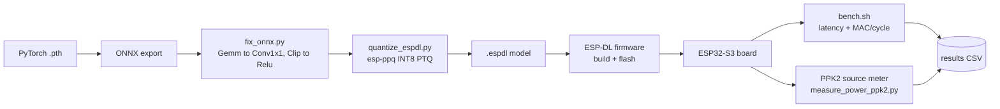

# INT8 CNN Benchmark on ESP32-S3 (Xtensa LX7)

Latency, energy and MAC/cycle of INT8 CNNs on the ESP32-S3 (Xtensa LX7, dual core,
240 MHz) with [ESP-DL](https://github.com/espressif/esp-dl). Fills the Xtensa LX7
column of an IEEE TIM cross-platform table.

Energy is measured with a Nordic PPK2 source meter on the 3V3 rail. 10 runs of
continuous inference per model.

## Pipeline



## Results (INT8, EuroSAT)

| Model        | MMAC  | ms/inf | mJ/inf         | MAC/cycle |
|--------------|-------|--------|----------------|-----------|
| MobileNetV3  | 6.12  | 34.81  | 8.846 ± 0.013  | 0.7325    |
| MCUNetV1     | 20.41 | 75.93  | 19.883 ± 0.037 | 1.1200    |
| EfficientNet | 32.17 | 252.48 | 63.028 ± 0.155 | 0.5309    |
| SqueezeNet   | 51.61 | 130.03 | 34.685 ± 0.055 | 1.6537    |

Active power is 250 to 267 mW board level for all models. Energy per MAC is
0.67 to 1.96 mJ/MMAC, in line with the reference below.

## Host setup

Benchmark and power scripts run in a [uv](https://docs.astral.sh/uv/) venv:

```bash
uv venv esp32-s3-profiling
source esp32-s3-profiling/bin/activate
uv pip install -r requirements-host.txt
```

## Docker (build, flash, quantize)

| Image | Build |
|-------|-------|
| `espressif/idf:release-v5.3` | `docker compose pull` |
| `model-convert` (onnx2tf) | `docker build -t model-convert -f convert/Dockerfile convert/` |
| `esp-ppq` (quant, numpy<2) | `docker build -t esp-ppq -f convert/Dockerfile.esp-ppq convert/` |

## Run

One firmware serves both phases: it prints a latency line on boot, then loops
forever for the PPK2. No firmware swapping.

```bash
# Latency + MAC/cycle (USB-JTAG). All models, or pass names to filter.
./espdl_bench/bench.sh
./espdl_bench/bench.sh SqueezeNet MCUNetV1

# Energy with the PPK2 (board on PPK2, USB unplugged). One model per run;
# latency is read back from results/bench_results.csv.
python3 espdl_bench/measure_power_ppk2.py SqueezeNet
```

`bench.sh` writes `results/bench_results.csv` and folds in PPK2 energy if a
`results/power_<model>_int8.csv` exists. Quantize with
`convert/quantize_espdl.py` (ONNX to INT8 `.espdl`); both convert scripts and
`bench.sh` take an optional model-name filter.

## Hardware

- ESP32-S3-EYE, 8 MB octal PSRAM, 8 MB flash. USB-JTAG shows up as `/dev/ttyACM0`
  (`303a:1001`).
- Needs ESP-DL 3.3.5 (3.3.4 loader crashes on INT16 requant params).
- PPK2 source mode: `VOUT` to `J9 pin 2 (VDD_3V3)`, `GND` to `J9 GND`. Board boots
  from VOUT, no USB needed.

### Wiring


| Wire  | Pin       |
|-------|-----------|
| Green | PIN48     |
| Red   | VCC 3.3V  |
| Blue  | GND       |

## References

Power meter — Nordic Power Profiler Kit 2 (PPK2), source-meter mode:

- Product: <https://www.nordicsemi.com/Products/Development-tools/Power-Profiler-Kit-2>
- Python driver (`ppk2-api`): <https://github.com/IRNAS/ppk2-api-python>

Same chip, same meter (PPK2), CNN inference energy:

> B. Karic, N. Herrmann, J. Stenkamp, P. Scharf, F. Gieseke, A. Schwering.
> *Send Less, Save More: Energy-Efficiency Benchmark of Embedded CNN Inference vs.
> Data Transmission in IoT.* arXiv:2510.24829 (2025).
> <https://arxiv.org/abs/2510.24829>
